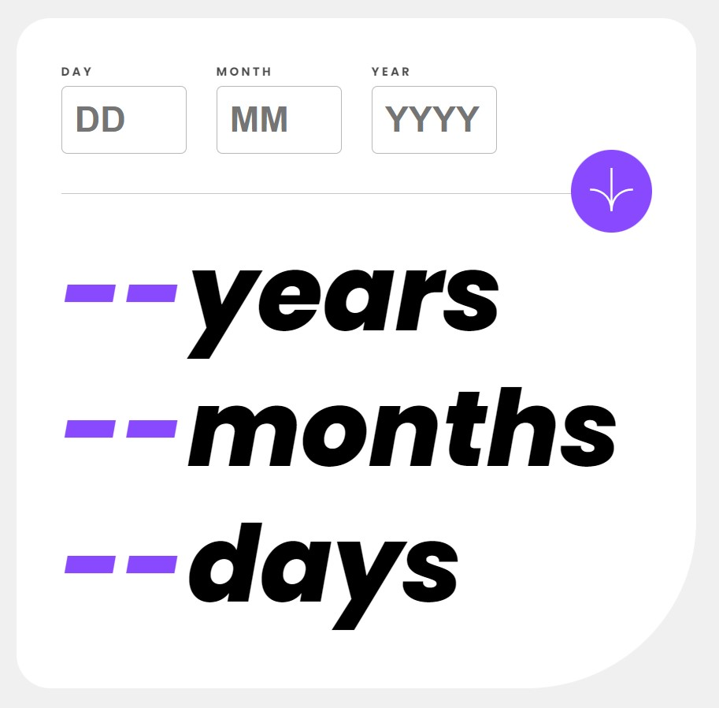

<h1>Age-Calculator-App</h1> 
<h2>This is a solution to the <a href='https://www.frontendmentor.io/challenges/age-calculator-app-dF9DFFpj-Q'>Age calculator app challenge on Frontend Mentor</a>. Frontend Mentor challenges help you improve your coding skills by building realistic projects. </h2>
<ul>
  <li><a><strong>Overview</strong></a></li>
   <ul>
     <li><a>The challenge</a></li>
   <li><a>Screenshot</a></li>
   <li>Links</li>
   </ul>
   <li><a><strong>My process</strong></a></li>
   <ul>
   <li>Built with</li>
   <li>What I learned</li>
   <li>Continued development</li>
  </ul>
   <li><strong>Author</strong></li>
</ul>

## Overview

### The challenge

Users should be able to:

View an age in years, months, and days after submitting a valid date through the form

Receive validation errors if:

<ul>
<li>Any field is empty when the form is submitted</li>
 <li>The day number is not between 1-31</li>
  <li>The month number is not between 1-12</li>
  <li>The year is in the future</li>
  <li>The date is invalid e.g. 31/04/1991 (there are 30 days in April)</li>
</ul>

View the optimal layout for the interface depending on their device's screen size

See hover and focus states for all interactive elements on the page

 <strong>Bonus:</strong> See the age numbers animate to their final number when the form is submitted

### Screenshot

### Links

<a href='https://github.com/VladkaG/Age-Calculator-App'>Solution URL</a>

<a href='https://teal-biscochitos-521320.netlify.app/'>Live Site URL</a>

## My process

### Built with

- Semantic HTML5 markup
- CSS custom properties
- Flexbox
- Vanilla JavaScript

### What I learned

I learned more about HTML forms and how to change them with CSS. Actually, this is my first app where I seriously use javascript, so all this part with the functionality was a new experience for me.

### Continued development

I want to learn 'React' and write apps with this framework, also rewrite this Agge Calculator App with 'React'.

## Author

- Website - <a href='https://tubular-gumption-959c62.netlify.app/'>Vladyslava Hryshyna</a>
- Frontend Mentor - [@VladkaG](https://www.frontendmentor.io/profile/VladkaG)
- <a href='https://www.linkedin.com/in/vladyslava-hryshyna-3a1b49263/'>LinkedIn</a>
